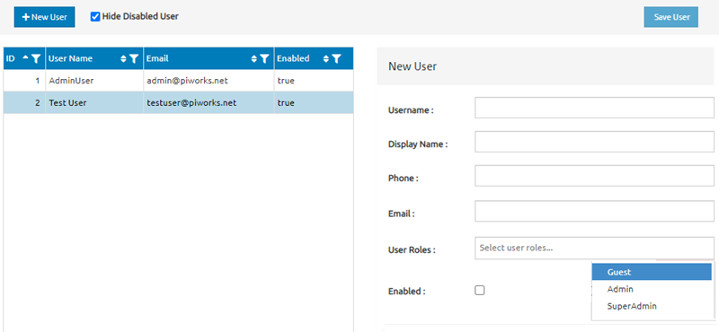

# User Management Screen Specification

## Overview

This document outlines the user interface (UI) requirements for the User Management screen. The screen allows an administrator to view, add, edit, and disable users in the system.

## UI Components

### 1. Toolbar

- *New User Button*: A button labeled "New User" located at the top left of the screen.
  - *Action*: Opens a blank "New User" form on the right side of the screen for adding a new user.
- *Hide Disabled User Checkbox*: A checkbox labeled "Hide Disabled User" located next to the "New User" button.
  - *Default State*: Checked.
  - *Action*: When checked, disabled users are hidden from the user list. When unchecked, all users are displayed.
- *Save User Button*: A button labeled "Save User" located at the top right of the screen.
  - *Action*: Saves changes made to a selected user's details or a new user.

### 2. User List Table

- A table displaying existing users with the following columns:
  - *ID*: A unique identifier for each user.
  - *User Name*: The username of the user.
  - *Email*: The user's email address.
  - *Enabled*: A boolean value indicating if the user is active or disabled.
- *Sorting*: Each column header is sortable by clicking the header.
- *Selection*: Clicking on a user row populates the "New User" form on the right with the user's details for editing.

### 3. New User Form

Located on the right side of the screen, this form allows the administrator to add or edit user details.

- *Fields*:
  - *Username*: A text input field for entering the user's username.
  - *Display Name*: A text input field for entering the user's display name.
  - *Phone*: A text input field for entering the user's phone number.
  - *Email*: A text input field for entering the user's email address.
  - *User Roles*: A dropdown menu for selecting the user's role(s). Available options are:
    - Guest
    - Admin
    - SuperAdmin
  - *Enabled*: A checkbox for marking the user as active (checked) or disabled (unchecked).

### 4. Behavior and Interactions

- *Page Load*: On initial load, the user list is displayed with all active users, sorted by ID in ascending order. The "Hide Disabled User" checkbox is checked by default.
- *Adding a User*: Clicking "New User" clears the form and allows input for a new user. The "Save User" button becomes enabled after all required fields are filled.
- *Editing a User*: Selecting a user from the table populates the form with the user's details. The administrator can edit any field except the ID. The "Save User" button saves the changes.
- *Hiding Disabled Users*: Toggling the "Hide Disabled User" checkbox filters the user list.
- *Saving Changes*: Clicking the "Save User" button after adding or editing a user validates the inputs. If validation passes, the changes are saved; if not, an error message is displayed.

### 5. Error Handling

- *Form Validation*: All fields are required. Email must be in a valid format.
- *Error Messages*: Displayed inline next to the corresponding field if there are validation errors.
- *Save Confirmation*: A confirmation message is displayed upon successful save.

## Initial State

- The "New User" button is enabled.
- The "Hide Disabled User" checkbox is checked.
- The user list shows all enabled users.
- The "Save User" button is disabled until a user is selected or a new user form is filled.

## Accessibility

- All interactive elements (buttons, checkboxes, inputs) should be keyboard-navigable.
- Ensure proper labeling for screen readers.

## Responsiveness

- The layout should adapt to various screen sizes, keeping the user list and "New User" form visible.

## User Stories and Scenarios

### User Story 1: Adding a New User
*As an administrator, I want to add a new user to the system so that they can have access to the platform with appropriate roles.*

*Scenario:*
1. The administrator clicks the "New User" button.
2. The "New User" form appears on the right side of the screen with all fields empty.
3. The administrator fills out the "Username", "Display Name", "Phone", and "Email" fields.
4. The administrator selects the "User Roles" from the dropdown (e.g., Guest).
5. The administrator checks the "Enabled" checkbox to activate the user.
6. The "Save User" button becomes enabled.
7. The administrator clicks "Save User".
8. The new user is added to the system, and a confirmation message appears.
9. The new user appears in the User List Table with the entered details.

### User Story 2: Editing an Existing User
*As an administrator, I want to edit an existing user’s details so that their information is up to date.*

*Scenario:*
1. The administrator views the User List Table.
2. The administrator clicks on the row of the user to be edited.
3. The "New User" form is populated with the selected user’s details.
4. The administrator updates the desired fields, such as changing the "Email" or updating the "User Roles".
5. The administrator clicks the "Save User" button.
6. The updated details are saved, and a confirmation message is displayed.
7. The changes are reflected in the User List Table.

### User Story 3: Disabling a User
*As an administrator, I want to disable a user who should no longer have access to the system.*

*Scenario:*
1. The administrator selects a user from the User List Table.
2. The administrator unchecks the "Enabled" checkbox in the "New User" form.
3. The administrator clicks the "Save User" button.
4. The user is disabled, a confirmation message is displayed, and the "Enabled" status in the User List Table is updated to "false".
5. If the "Hide Disabled User" checkbox is checked, the disabled user is removed from the User List Table.

### User Story 4: Filtering Disabled Users
*As an administrator, I want to be able to hide disabled users from the list to focus on active users only.*

*Scenario:*
1. On the initial page load, the "Hide Disabled User" checkbox is checked.
2. The User List Table displays only active users.
3. The administrator unchecks the "Hide Disabled User" checkbox.
4. The User List Table updates to display both active and disabled users.
5. The administrator checks the "Hide Disabled User" checkbox again, and the disabled users are hidden from the list.

### User Story 5: Sorting Users by Columns
*As an administrator, I want to sort users by their ID, username, email, or enabled status to find users more easily.*

*Scenario:*
1. The administrator clicks on the "ID" column header.
2. The User List Table is sorted by ID in ascending order.
3. The administrator clicks the "User Name" column header.
4. The User List Table is sorted by username in ascending order.
5. The administrator clicks the "User Name" column header again.
6. The User List Table is sorted by username in descending order.
7. The same process can be repeated for the "Email" and "Enabled" columns.